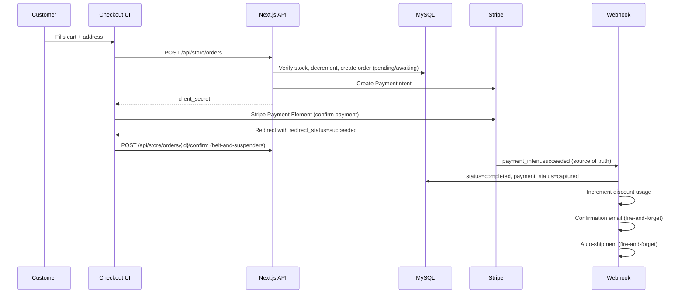

# Purchase Workflow — Tsuky Tales

## Overview



## Order Lifecycle

### Status

| Status | Description |
|---|---|
| `pending` | Order created, awaiting payment |
| `completed` | Payment confirmed |
| `canceled` | Cancelled (payment failure, expiration, refund) |
| `archived` | Manually archived |
| `requires_action` | Action required (3DS, etc.) |

### Payment Status

| Payment Status | Description |
|---|---|
| `awaiting` | Awaiting payment |
| `captured` | Payment captured |
| `canceled` | Payment cancelled |
| `refunded` | Fully refunded |
| `partially_refunded` | Partially refunded |

### Transitions

```
pending/awaiting → completed/captured    (successful payment)
pending/awaiting → canceled/canceled     (failure, expiration, abandonment)
completed/captured → canceled/refunded   (admin refund)
```

## Handled Webhook Events

| Stripe Event | Action |
|---|---|
| `payment_intent.succeeded` | Confirms the order (status=completed, payment_status=captured), increments discount usage, sends email, triggers auto-shipment |
| `payment_intent.payment_failed` | Cancels the order + restores stock |
| `payment_intent.canceled` | Cancels the order + restores stock (PI expired after 7 days) |
| `invoice.paid` | Creates a subscription order (with deduplication by invoice_id). Uses the **currently active product** (not the one from signup) and the customer's **current default address**. See [subscription-workflow.md](./subscription-workflow.md) for details. |
| `subscription_schedule.canceled` | Cleans up customer metadata |

### Webhook Security

- Stripe signature verification is **mandatory** (`STRIPE_WEBHOOK_SECRET` must be configured)
- Without a configured secret: returns 500 (no `JSON.parse` fallback)
- Invalid signature: returns 400

## Guest Checkout

Non-authenticated users can place orders:

1. The UI displays a required email field
2. The API accepts `guest_email` in the request body
3. A customer record is found or created with `has_account: false`
4. The order is linked to this customer
5. The `/api/store/orders` and `/api/store/orders/{id}/confirm` routes accept unauthenticated requests

In the back-office, guests are identifiable by `has_account = false`.

## Promo Codes

### Lifecycle

1. **Validation** (checkout UI): `POST /api/store/promo` verifies the code is valid
2. **Reservation** (order creation): the code is re-validated, `discount_id` is stored in metadata, the counter is **not** incremented
3. **Increment** (payment confirmation): `usage_count` is incremented only in `confirmOrder` or `payment_intent.succeeded`

This ensures promo codes are only counted for successful payments.

## Stock Safety

### Decrement

Stock is decremented **atomically** during order creation (`createOrder`), within a MySQL transaction using `WHERE stock >= ?` to prevent negative values.

### Restoration

Stock is restored in the following cases:

| Event | Trigger |
|---|---|
| Payment failure | Webhook `payment_intent.payment_failed` |
| PI expired/cancelled | Webhook `payment_intent.canceled` |
| Admin refund | Route `POST /api/admin/orders/refund` |
| Creation error | MySQL transaction rollback |

Restoration uses `restoreStock()` which re-increments quantities for each item (product or variant).

## Audit History

Each order has a `metadata.history` field (JSON array) that tracks transitions:

```json
{
  "history": [
    { "date": "2026-02-26T10:00:00.000Z", "status": "pending", "label": "Order created" },
    { "date": "2026-02-26T10:01:00.000Z", "status": "completed", "label": "Payment confirmed via webhook" },
    { "date": "2026-02-27T14:00:00.000Z", "status": "refunded", "label": "Order fully refunded — stock restored" }
  ]
}
```

The `pushOrderHistory()` helper is used everywhere to ensure a consistent format.

## Operator Guide

### Refunding an Order

1. Go to Admin > Orders
2. Find the order and click "Refund"
3. The system creates a Stripe refund, restores stock, and updates the status

### Identifying Stuck Orders

Search for orders with `status = 'pending'` and `payment_status = 'awaiting'` older than 24 hours. These correspond to abandoned payments that were not cleaned up by the `payment_intent.canceled` webhook.

### Retrying Shipment

If auto-shipment fails (Boxtal API error), the order remains at `fulfillment_status = 'not_fulfilled'`. The operator can manually retry from the admin panel.

### Required Environment Variables

| Variable | Description |
|---|---|
| `STRIPE_SECRET_KEY` | Stripe secret key |
| `STRIPE_WEBHOOK_SECRET` | Stripe webhook secret (required in production) |
| `NEXT_PUBLIC_STRIPE_PUBLISHABLE_KEY` | Stripe publishable key |
| `RESEND_API_KEY` | Resend API key for emails |
