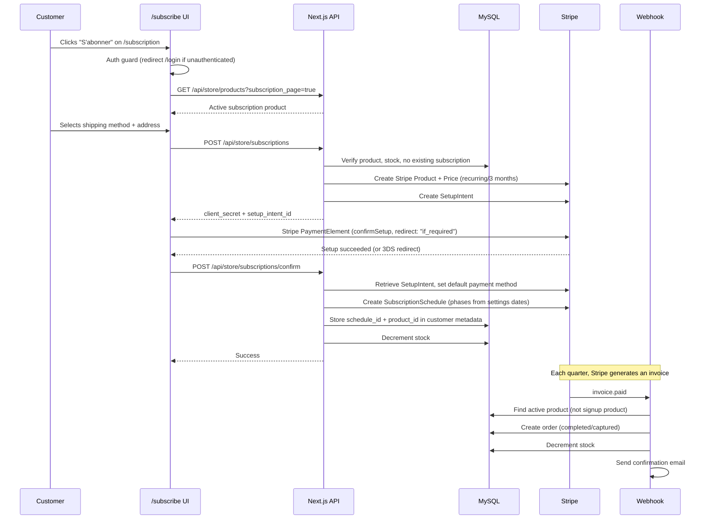

# Subscription Workflow — Tsuky Tales

## Overview



## Pages

| Route | Role |
|---|---|
| `/subscription` | Marketing page — product info, pricing, billing dates, CTA button |
| `/subscribe` | Checkout page — shipping, address, Stripe SetupIntent, confirmation |
| `/account?tab=subscription` | Customer subscription management (skip, cancel, payment methods) |

## Subscription Creation Flow

### Step 1 — Product Loading

The `/subscribe` page fetches the active subscription product:

```
GET /api/store/products?subscription_page=true&locale={locale}
```

Returns the product with `is_subscription = true` and `is_active = true`.

### Step 2 — Shipping & Address

Same UX as checkout:
- **Relay point** or **home delivery** toggle
- Saved addresses (logged-in users) or manual address form
- Shipping rates fetched via `GET /api/store/shipping/rates`

### Step 3 — Create Subscription (`POST /api/store/subscriptions`)

**Validations:**
- Product exists and `is_subscription = true`
- Product has stock > 0
- Customer does not already have a `subscription_schedule_id` in metadata

**Actions:**
1. Creates a Stripe Product + Price (recurring, 3-month interval)
2. Calculates shipping cost based on method and country
3. Total per quarter = `subscription_price + shipping_cost`
4. Creates a SetupIntent (card-only)
5. Returns `client_secret`, `setup_intent_id`, `shipping_cost`, `total_per_quarter`

### Step 4 — Payment (Stripe Elements)

Uses `stripe.confirmSetup()` with `redirect: "if_required"` (same pattern as payment method tab). On success, calls the confirm endpoint. On 3DS redirect, the page detects `?confirming=true&setup_intent=...` on mount and calls confirm.

### Step 5 — Confirm (`POST /api/store/subscriptions/confirm`)

**Input:** `setup_intent_id`

**Actions:**
1. Retrieves SetupIntent from Stripe, verifies `status === "succeeded"`
2. Sets the payment method as the customer's default
3. Reads subscription billing dates from `settings` table (`subscription_dates` key)
4. Creates a Stripe SubscriptionSchedule with phases aligned to billing dates
5. Stores in customer metadata: `subscription_schedule_id`, `subscription_product_id`, `subscription_shipping`
6. Decrements product stock

## Recurring Billing — `invoice.paid` Webhook

When Stripe generates and charges an invoice for a subscription, the webhook creates an order:

### Active Product Resolution

The webhook does **not** use the `subscription_product_id` stored at signup. Instead, it queries the currently active product:

```
productRepository.findActiveSubscriptionProduct()
→ SELECT * FROM products WHERE is_active = 1 AND (is_deleted = 0 OR is_deleted IS NULL)
  ORDER BY createdAt DESC LIMIT 1
```

This ensures that when the product changes between quarters (new box edition), the order references the correct product. Falls back to the customer's `subscription_product_id` metadata if no active product is found.

### Shipping Address Resolution

The webhook fetches the customer's current default address from the `addresses` table (sorted by `is_default DESC`), rather than relying solely on the static `subscription_shipping` metadata. This ensures address updates are reflected in future orders.

Falls back to the `subscription_shipping` metadata if no saved address exists.

### Order Creation

| Field | Value |
|---|---|
| `status` | `completed` |
| `payment_status` | `captured` |
| `items` | `[{ id, name, price, quantity: 1 }]` |
| `metadata.subscription` | `true` |
| `metadata.stripe_invoice_id` | Invoice ID (used for idempotence) |
| `metadata.stripe_subscription_id` | Subscription ID |

### Idempotence

Before creating an order, the webhook checks `orderRepository.findByInvoiceId(invoice.id)`. If an order already exists for this invoice, processing is skipped.

## Subscription Lifecycle Events

| Stripe Event | Action |
|---|---|
| `invoice.paid` | Create order for the quarter |
| `invoice.payment_failed` | Log warning, Stripe retries automatically |
| `customer.subscription.updated` | Log status change |
| `customer.subscription.deleted` | Clean up customer metadata |
| `subscription_schedule.canceled` | Remove `subscription_schedule_id` from customer metadata |
| `subscription_schedule.completed` | Schedule finished (all phases completed) |

## Customer Self-Service

Available at `/account?tab=subscription`:

| Action | API |
|---|---|
| Skip next quarter | `POST /api/store/subscriptions/skip` |
| Unskip | `POST /api/store/subscriptions/unskip` |
| Cancel subscription | `POST /api/store/subscriptions/cancel` |
| Update payment method | Via payment methods tab |

## Error States

| Error | Handling |
|---|---|
| Already subscribed | Shows message + link to `/account?tab=subscription` |
| Product out of stock | "S'abonner" button disabled |
| No active product | "No product available" message |
| SetupIntent failure | Error message displayed, user can retry |
| 3DS failure | Error message after redirect |
| Confirm API failure | Error message, user can retry |

## Key Files

| File | Role |
|---|---|
| `app/[locale]/(site)/(store)/subscribe/page.tsx` | Subscribe checkout UI |
| `app/[locale]/(site)/(store)/subscription/page.tsx` | Marketing page (CTA → `/subscribe`) |
| `app/api/store/subscriptions/route.ts` | Create subscription (SetupIntent) |
| `app/api/store/subscriptions/confirm/route.ts` | Confirm subscription (SubscriptionSchedule) |
| `app/api/webhooks/stripe/route.ts` | `invoice.paid` → order creation |
| `lib/repositories/product.repository.ts` | `findActiveSubscriptionProduct()` |
| `components/account/payment-methods-tab.tsx` | Stripe SetupIntent pattern reference |
